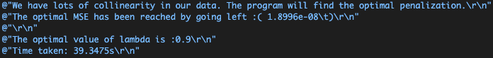

# Finding optimal penalization parameter lambda for Lasso Regression using Coordinate Descent - Martin Stelmach - February 21, 2021

## Summary of Project

The goal of the program created is to take user find the optimal value of lambda for which we do penalized regression. This is done by taking a user defined randomly generated dataset and doing coordinate descent along log-spaced lambda values until the penalization has been performed. From there the optimal lambda is selected via cross validation and the penalized mean squared error is compared to the standard OLS proving that the lasso is a better fit but avoids overfitting, as we will further see. It is worth mentioning that lasso optimization is not a closed form solution so a forward stagewise algorithm is implemented. 

## Explanation of Algorithm

Regression is used for a multitude of things and is one of the most important things in todays world. For this reason there are so many different things one can do with regression to try and fit data better. 

## Implementation

### Libraries 
For this program a multitude of libraries were used, including ctime, to time the length of the program, random to randomly generate data, algorithm to use functions such as `swap`, fstream to read in data and a few others for various purposes.
  
``` cpp

#include <iostream>
#include <vector>
#include <initializer_list>
#include <random>
#include <ctime>
#include <algorithm>
#include <fstream>
#include <cassert>
#include <iomanip>

using namespace std;
```

### Reading input

The program begins with reading the text file in the document to create the matrix size in order the generate the date. This is done in a class that reads each individual character in the file and stores it as a vector that can be easily accessed. 

```cpp
class read_matsize
{
    string fileName;

public:
    read_matsize(string filename) : fileName(filename)
    {
    }

    vector<double> getData();
};
//Used to read in matrix size for user input
vector<double> read_matsize::getData()
{
    ifstream file(fileName);

    vector<double> matsize;
    double value;

    while (file >> value)
    {
        matsize.push_back(value);
    }
    file.close();

    return matsize;
}
```

### Randomize the Data

So once the size of the matrix is inputted by the user, the values of the matrix are randomized using the uniform distribution. 

```cpp
//Create Random values inside a matrix
matrix randomize(matrix p)
{
    random_device rd;
    mt19937 mt(rd());
    uniform_int_distribution<int> uid(0, 200); //Sampled from uniform distribution

    size_t rows{p.get_rows()}, col{p.get_cols()};
    for (size_t i{0}; i < rows; ++i)
    {
        for (size_t j{0}; j < col; ++j)
        {
            p(i, j) = uid(mt); //Fills every value with a random one
        }
    }
    return p;
}
```

### Matrix class and Operators

The matrix class is the most important class since it defines matrixies and their respective operators. Since it was created in class there is not neccessarily too much to comment on it other than the additions made to it. Two division operators were added to do division of a scalar into a matrix and to do elementwise division of a matrix respectively. Although it linear algebra matrices are obviously not divided, element wise division will be used in the program.

```cpp

matrix operator/(const matrix &m, const double &n)
{
    size_t rows{m.get_rows()};
    size_t cols{m.get_cols()};
    matrix w(rows, cols);
    for (size_t i{0}; i < rows; ++i)
    {
        for (size_t j{0}; i < cols; ++j)
        {
            w(i, j) = m(i, j) / n;
        }
    }

    return w;
}

matrix operator/(const matrix &m, const matrix &n)
{
    size_t rows{m.get_rows()};
    size_t cols{m.get_cols()};
    if (rows != n.get_rows() or cols != n.get_cols())
    {
        throw matrix::incompatible_sizes_add{};
    }
    matrix w(rows, cols);
    for (size_t i{0}; i < rows; ++i)
    {
        for (size_t j{0}; j < cols; ++j)
        {
            w(i, j) = m(i, j) / n(i, j);
        }
    }

    return w;
}

```

### Variance Inflation Factor

In order to decide if ridge regression is appropriate on the data generated, we must test for multicollinearity. This means that we should compute the variance inflator factor and decide if it is neccessary to use ridge regression on the dataset. It is usually necessary when a variance inflation factor of anything over 10 is found. It can be found via VIF = 1/ (1-R^2), where R^2 = 1 - (sum of squares of residuals / sum of squares total). 

### Exceptions

Once it is determined the dataset is appropriate, we will compute the initial mean squared error of the program. This is not as easily done, since if we run into any mishaps obviously the matrix operations cannot happen. The matrix class takes care of many of these things such as ensuring matrixing are of proper size in order to multiply or add, but for more complicated operations such as matrix inversion, more exceptions had to be added. 

```cpp
 catch (const matrix::matrix_not_square &e)
    {
        cout << "Error: The matrix is not square anf therefor the inverse cannot be taken!\n";
    }
```

The above is an example of rules needed for standard matrix operations to occur, and such have been added throughout. 

### Matrix operations

As mentioned, with most regression, matrix operations are very prominent and done often. This involved lots of matrix manipulation which made matrix operations much simpler. For example, when we need a matrix to take reduced row echelon form, we were able to use the `swap` function from the C Standard Template Library `<algorithms>`. This man moving functions around much simpler. 

```cpp
void swap_rows(matrix &m, size_t i, size_t j)
{
    size_t columns = m.get_cols();
    for (size_t column = 0; column < columns; ++column)
        std::swap(m(i, column), m(j, column));
}
```
Using these libraries effectively made my code more efficient since they did not have to be writen from scratch.

The matrix operations done were the ones needed to solve for the coefficient matrix, similar to ordinary least squares, for ridge regression. This solved to be `Beta^ = (X'X + aI)^-1 X' Y`. Once the coefficients were computed, we needed to find the mean squared error. This is found via the formula `MSE = 1/n e^2 = 1/n e^T * e`. Once we have found an initial MSE to begin with, we can start to determine which direction we will go in. What I mean by this is we have select some point along the convex hull however unsure which direction to go in. For this we will find one step size to the left and one step size to the right and then compare the two. Whichever is lower will dictate the direction we will follow till we have reached the absolute minima. 

```cpp
if (MSEgreat(0, 0) > MSEless(0, 0))
            {
                while (prevMSE(0, 0) > MSEless(0, 0)) // Looking for change of direction
                {
                    prevMSE = MSEless;
                    cout << prevMSE;
                    lesserk = lesserk - stepsize;
                    matrix lessererror = finderror(X, Y, lesserk);
                    matrix MSEless = n * (transpose(lessererror) * lessererror);
                    cout << MSEless;
                }
                cout << "The optimal MSE has been reached by going left :" << MSEless;
                cout << "The optimal value of lambda is :" << lesserk;
            }
            if (MSEgreat(0, 0) < MSEless(0, 0))
            {

                while (prevMSE(0, 0) > MSEgreat(0, 0)) //Looking till change of direction
                {
                    prevMSE = MSEgreat;
                    greaterk = greaterk + stepsize;
                    matrix greatererror = finderror(X, Y, greaterk);
                    matrix MSEgreat = n * (transpose(greatererror) * greatererror);
                    cout << greaterk;
                }
                cout << "The optimal MSE has been reached by going right :" << MSEgreat;
                cout << "The optimal value of lambda is :" << greaterk;
            }
```

This method of gradient descent allows us to find the minima for function and the appropriate lambda.
All these matrix manipulations are also subject to exceptions that are defined via throw and catch method to catch for and operations that would not be possible.

### Sample outputs

Using the same txt file as attached above, the program was very effective is determining if collinearity existed. The following is a sample output from when the program was executed. 



### Future advancements

Attempted applying templates<T> such that all functions had a defined type but ran into errors that could not be solved before submission date. 
  
## Acknowledgements

Special thanks to Professor Barak Shoshany of McMaster University for guidance and aid throughout the project. 
